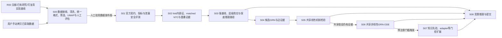

# Arc VCC 2026 项目总设计

## 科学问题

比赛要求在只看到匿名新细胞背景的 NTC 单细胞表达时，预测指定基因被 CRISPRi knockdown 后的单细胞 raw counts。项目要检验的核心假设是：NTC 分布提供可迁移的初始状态，跨细胞背景 perturbation 数据可约束一部分共享响应机制；二者能否解耦必须由严格的跨背景留出实验检验。

## 设计原则

- 先建立 R00 文献、已有研究和可复用实现基线；每个阶段实际开工时仍重新执行 T00 调研与复用决策。
- 项目现有实现、标准/native 能力、已安装依赖和参考资料库登记的成熟官方实现优先；自建核心 module 必须有不兼容证据和人工批准。
- 从用户完成数据拷贝后的只读接收开始；数据调研和获取不属于本计划。
- 先得到可审计、格式统一且经人工诊断的数据发布版，再开始任何模型拟合。
- 先锁定官方输入、输出和评分契约，再建立不可跳过的强基线。
- 复杂度按证据升级：线性基线 → 共享线性机制 → 共享非线性 GRN-ODE → 有门控的知识先验或 adapter。
- 保留原始 counts、状态差异和不确定性；不以无约束 batch integration 抹平细胞背景。因果证据按 E1 实验内分配效应、E2 实际敲低剂量效应、E3 跨背景运输效应和 E4 比赛预测分布分层。
- UMAP 与人工评估用于诊断数据结构，不承担科学结论或候选选择职能。
- 每个阶段区分工程验收与科学判断，并在人工闸门处停止。

## 总流程

R00 不依赖训练数据拷贝。S00–S08 每个阶段都以自己的 `T00` 现场调研开始；R00 registry、阶段必读清单和旧方法卡只能缩小搜索范围，不能替代开工时对当前版本、许可、task fit 和新文献的复核。因果能力的现场调研必须覆盖 estimand、统计单位、协变量时间顺序、选择/干扰、层级效应汇总与条件触发的强假设方法。

S03 起即保留一条可交付的保底路径；后续复杂模型未获支持时，S08 应回退到已冻结且验证最好的简单模型，而不是为了“完成路线”强行保留复杂度。

## 资料权威关系

- `技术路线与项目设计.md`：科学动机、核心假设与解释边界。
- `技术路线与项目设计-v2.md`：较细的实现输入，但不是当前执行计划；其中下载阶段、H1 合规警告及若干过早固定的方法需按最新官方规则与真实数据重新审查。
- [`参考资料库/rules.md`](../参考资料库/rules.md)：调研、归档、复用决策与自建例外的权威合同；当前官方比赛合同以 [`2026 VCC 官方信息核验`](../参考资料库/竞赛资料/2026_VCC_官方信息核验_2026-08-30.md) 为 2026-08-30 快照入口。
- `document/项目审计/`：历史审计和本轮工程化审阅，不等同于当前数据状态。
- 根 `.doc/AI_plan.md`：阶段路由；各阶段 `.doc/AI_plan.md`：唯一详细执行合同。

本轮因果审阅已合并进原始审阅报告；报告归档后作为本次合同修订的审计入口，不替代各阶段的 T00 实时调研。

## 当前公开比赛契约快照

截至 2026-08-30，官方公开材料描述验证背景 A/B/C 与终测背景 D/E/F；每轮三个背景共享 300-gene panel，每个背景/perturbation 需生成 400 个细胞，固定 18,533 genes，提交为 raw non-negative integer counts。工程执行仍必须在 S01 重新锁定当时的官方 bundle、CLI/scorer 版本与服务端规则，因为官方文档之间尚存在“预测细胞数/是否含 NTC”的冲突。

## 完成含义

项目完成不是“所有高级模块都运行过”，而是：每个已执行阶段有现场复用决策和可追溯方法来源，至少一条冻结的 E4 预测路径通过内部 OOD 验证、官方格式验证和可复现审计；所有未获支持的 E1-E3 科学主张、直接边主张与未启用的扩展都被明确保留为 `unresolved` 或 `not_tested`。
