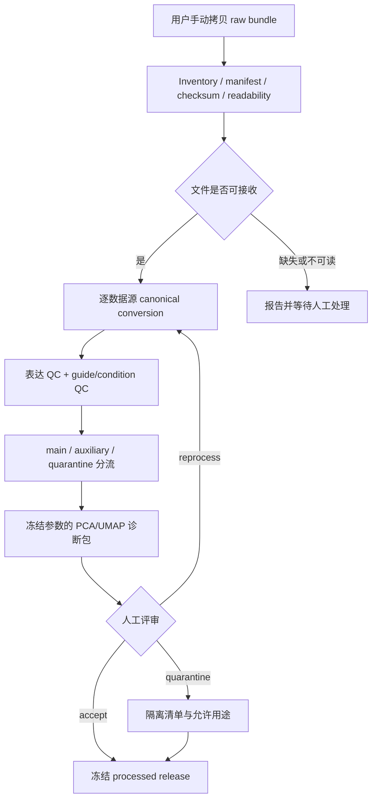

# S00 数据接收、QC 与人工诊断设计

## 阶段定位

S00 是项目真正开始处理数据的第一阶段，但不是数据获取阶段。它只在用户把已经获取并批准的数据手动拷贝到项目后启动。这个阶段的职责，是把来源各异的文件整理成一个后续模型可以共同使用、同时仍能追溯回原始证据的数据发布版。

上游数据可能来自 H5AD、10x H5/MTX、H5MU、RDS/Seurat 等不同格式，也可能混有 CRISPRi、CRISPRa、KO、药物刺激、多 guide 或不同时间点。若不先把这些差异显式整理，后续模型很容易把文件格式、测序深度或实验协议当成生物学机制。

## 本阶段要回答的问题

1. 用户拷贝过来的文件是否完整、可读，并与数据卡和 manifest 对得上？
2. 每个 cell、gene、guide、target、NTC、batch、replicate 和 timepoint 的语义能否被可靠识别？
3. 哪些数据可以进入 CRISPRi 主训练域，哪些只能用于辅助评估，哪些必须隔离？
4. 数据中是否存在明显的低质量群、样本错配、guide assignment 问题或协议子集混杂？
5. 能否冻结一个不再被后续阶段随意改写的数据发布版？
6. 每个 metadata/QC 字段是在扰动前还是扰动后测量，属于设计变量、效应修饰、中介、选择变量还是纯诊断量？

这些问题都属于数据可用性和工程质量问题。S00 不检验共享机制是否成立，也不选择模型。

## 输入与输出

| 类型 | 内容 | 本阶段如何处理 |
| --- | --- | --- |
| 输入 | `Stage_0-raw_training_data/` 下的原始/processed 数据文件 | 只读保存，不覆盖、不原地解压或修复 |
| 输入 | `DATASET_CARD.md`、`MANIFEST.tsv`、许可和来源说明 | 与实际文件及字段逐项核对 |
| 派生输出 | 统一语义的稀疏 AnnData 或等价分片对象 | 保留 raw counts，并附完整 provenance |
| 派生输出 | QC 指标、清洗 flags、guide/condition 诊断 | 先标记、后决策，不直接无痕删除 |
| 决策输出 | main / auxiliary / quarantine 分流清单 | 说明每条记录允许进入哪条后续路线 |
| 人工输出 | UMAP/PCA 诊断包和评审决定 | 记录 accept、reprocess 或 quarantine 及理由 |
| 最终输出 | 带 release ID 的数据发布版 | 供 S01 之后的阶段只读引用 |

## 核心实现方式

### 1. 只读接收与复制完整性核验

首先对拷贝后的目录做 inventory：记录路径、字节数、文件类型、manifest 状态和 checksum。小文件可以完整读取；超大 H5AD/H5/RDS 只做格式级打开、shape、dtype 和关键字段抽查，避免为了“验证”而把整个对象载入内存。

这一步会区分四类状态：已收到且与上游 manifest 一致、已收到但缺少可比较 manifest、拷贝中缺失、文件不可读。缺失或损坏只报告给用户，不自动联网补齐。

### 2. 逐数据源格式转换

项目不会用一段通用脚本猜测所有文件。不同数据源使用各自的 adapter，把原有字段明确映射到统一语义：

- 表达矩阵统一为 `cells × genes`，保持稀疏；
- raw integer counts 与 normalized/log1p view 分层保存；
- `.obs` 统一表达 dataset、cell model、batch、replicate、time、modality、target、guide 和 NTC；
- `.var` 保留原始 gene symbol/ID、canonical mapping 和原始顺序；
- registry 另外记录 assignment unit、guide 分配方式、CRISPRi system、MOI、capture/culture 设计、敲低效率来源及可得的 pooled-culture/interference 信息；
- 每个转换对象记录源文件、转换配置、字段测量时间、协变量角色和无法映射的字段。

转换的重点不是把所有文件“变得一样”，而是把原有差异变成可见、可查询的 metadata。

### 3. 数据清洗与 QC

QC 会同时看表达质量和 perturbation 质量。表达侧包括 library size、检测基因数、线粒体/核糖体比例、可用时的 doublet 或 ambient 指标；perturbation 侧包括 guide UMI、guide 数量、target assignment、NTC 和多 guide 情况。

这些 QC 指标会保留其 `measurement_timing` 和 `covariate_role`。KD 后表达 QC、cell cycle、stress、凋亡、存活和捕获状态可能是中介或选择结果；S00 可以据其作质量诊断和人工分流，但不会把它们预先授权为 S02 的普通混杂调整变量。

阈值不会跨所有协议机械共用。项目先按 `dataset × sample × batch` 画分布，并用中位数/MAD 等鲁棒规则给出候选阈值，再由人工审阅冻结。清洗过程先产生 `qc_flag` 和排除原因，原始 cell 索引始终保留，从而可以复核“为什么少了这些 cells”。

### 4. 训练资格筛选与分流

主训练域优先保留：人源、单基因 CRISPRi、target/guide 可追踪、matched NTC 可用且许可允许的记录。其他情况分开处理：

- CRISPRa、KO、药物刺激和组合扰动进入辅助或独立评估支路；
- 多 guide、unassigned 或低置信 assignment 先隔离；
- 混合数据集只提取预先定义的 CRISPRi-only、DMSO-only 等兼容子集；
- metadata 或许可不足的数据保留资产，但不进入主训练域。

这里的筛选依据是数据角色和质量，不是 perturbation 是否产生“好看的响应”。

### 5. UMAP 与人工诊断

UMAP 用于发现样本错配、批次主导、质量梯度、NTC 异常和意外群体，不用于证明 batch 已消除。至少生成三类视图：NTC-only、按谱系/context 配额采样的全局视图、逐数据集视图。颜色面板包括 dataset、cell model、batch、replicate、condition、guide confidence 和 QC 指标。

PCA、neighbors 和 UMAP 参数在看图前冻结，并保存 exact cell list 和随机种子。人工评审按预先写好的问题检查每个数据集，给出 `accept`、`reprocess` 或 `quarantine`。若视觉判断与数值指标冲突，两者都保留，结论写作 `unresolved`，而不是凭观感覆盖数据。

### 6. 数据发布冻结

人工批准后，形成一个 versioned release。它包含 canonical/QC 对象、registry、field/covariate-role dictionary、分配与选择信息、分流清单、gene mapping、QC 与人工评审报告、配置和 manifest。后续阶段只引用 release ID，不再各自重新清洗同一批数据。

## 工作流

## 人工需要决定什么

- manifest 不一致或文件缺失是否允许以部分数据继续；
- 各协议的 QC 阈值与异常群处理；
- 每个数据集/条件的 accept、reprocess、quarantine；
- 最终数据发布版及隔离清单是否获准进入 S01。

字段级 schema、目标文件和测试闸门见同目录的 [`AI_plan.md`](AI_plan.md)。

## 完成后实现了什么

S00 完成意味着项目拥有一份统一、可读取、可追溯、经人工诊断的数据发布版，并且每条记录的用途明确。它不意味着数据没有偏差，也不支持共享机制、因果边或模型泛化；核心科学假设在此阶段仍为 `not_tested`。
