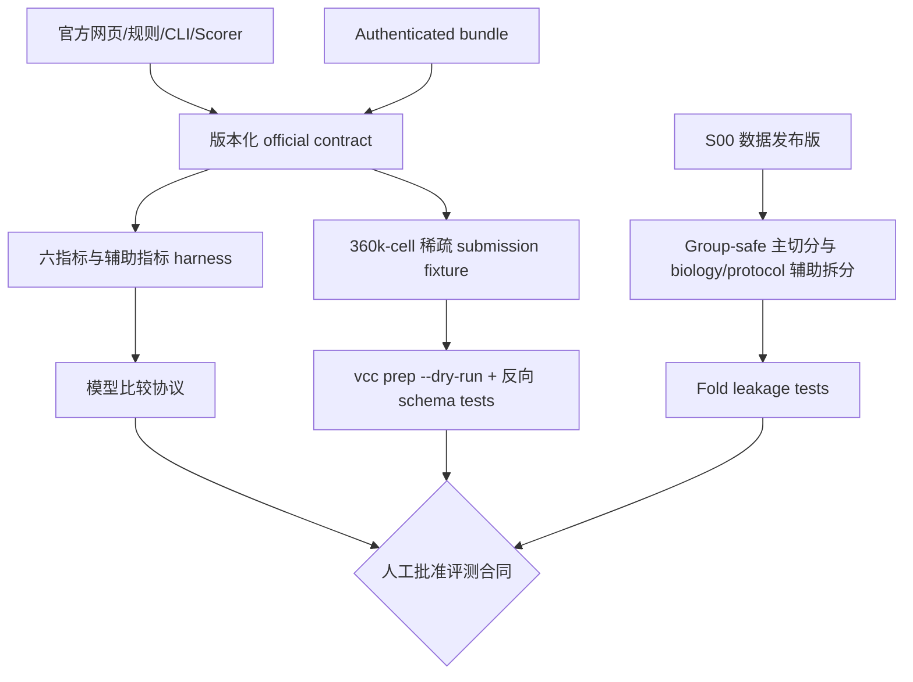

# S01 官方契约与泄漏安全评测设计

## 阶段定位

S01 在训练任何模型之前，先把“比赛究竟要求什么”和“内部实验怎样才算公平”固定下来。它相当于整个项目的测量尺：后续模型可以变化，但输入边界、留出方式、评分实现和晋级规则不能跟着结果临时变化。

这一步尤其重要，因为 2026 任务是匿名新 context 的 zero-shot 预测，官方提交又有严格的 raw-count、gene order、context label、cell number 和稀疏度要求。若只在模型完成后才接触这些约束，很可能出现内部指标很好、最终文件却无法提交，或内部切分已经泄漏 context 信息的问题。

## 本阶段要回答的问题

1. 当前官方 Rules、Data、Evaluation、CLI 和 scorer 对输入输出的真实要求是什么？
2. 官方文档之间存在冲突时，工程上按哪个可执行合同操作，并如何保留未决项？
3. 外部数据怎样切分，才能模拟“目标 context 只有 NTC、没有 KD 标签”的比赛场景？
4. 2026 六指标怎样被锁版、调用和解释？哪些辅助指标只服务科学诊断？
5. 怎样在模型研发前证明完整提交格式和泄漏防护路径可用？
6. 怎样把跨生物背景失败与跨 study/protocol 失败区分开，而不是都压缩成一个 LOCO 分数？

## 输入与输出

| 类型 | 内容 | 本阶段产物 |
| --- | --- | --- |
| 官方输入 | Rules、Data/Evaluation/FAQ、CLI、`cell-eval2`、validation bundle | 带版本、访问日期和冲突项的 official contract |
| 项目输入 | S00 数据发布版及 registry | 可分组的 context、perturbation、batch/replicate 信息 |
| 评测输出 | LOCO、LOPO、双留出 fold manifests | 后续所有模型共用的 OOD 切分 |
| 指标输出 | 六项官方指标与科学辅助指标 harness | 可重放、能区分 official/internal scaling 的评测层 |
| 格式输出 | 360,000-cell 稀疏 submission fixture | 在真实模型出现前验证完整 schema |
| 治理输出 | leakage tests 和 model-comparison protocol | 限制哪些信息可用于拟合和晋级 |

## 核心实现方式

### 1. 锁定官方操作合同

项目把官网规则、authenticated bundle 的 manifest、`vcc-cli`、`cell-eval2` 版本和配置共同登记。网页提供人的说明，实际 bundle 决定 contexts、panel 和 gene order，`vcc prep --dry-run` 则代表当前工具真正执行的格式约束。

已知的“每 perturbation 是否必须恰好 400 cells、提交是否包含 NTC”等官方来源冲突不会被静默删除。项目会记录双方原文和版本，提交操作暂以当时 CLI/服务端实际验收为准；若冲突影响路线，则交给用户或主办方确认。

### 2. 构造真正的 OOD 切分

核心切分不是随机拆 cells，而是按完整 context 分组：

- **LOCO**：整条 cell context 留出；训练时看不到该 context 的 KD response，推理时只给它的 NTC；
- **LOPO**：整类 perturbation 留出，检查是否能预测未见 target；
- **双留出**：context 与 perturbation 同时未见，模拟最困难的组合外推；
- **同 study 内 LOCO**：协议近似固定时检验跨生物背景泛化；
- **同 cell model 跨 study/protocol**：背景近似固定时检验协议鲁棒性；
- **Leave-one-study-out / leave-one-lineage-out**：分别压力测试新研究协议与更远生物谱系；
- **随机 cell split**：只用于检查代码能否运行，不用于证明 zero-shot 泛化。

后四类辅助拆分只有在实际 registry 存在足够 group 和交叉连接时才生成；缺少对应重复时记录 `not_estimable`，不能伪造平衡 fold。主模型晋级仍以比赛最接近的 LOCO 为主，辅助拆分用于原因定位。

同一 donor、cell model、batch/replicate 或同源样本必须按 registry 形成 group，避免它们被拆到训练和验证两边。gene selection、normalization、program basis、图阈值、超参数、calibration 等所有可学习或可选择步骤，都只能在训练 fold 内拟合。

### 3. 建立 2026 六指标 harness

官方评分由六个不同角度组成，项目直接调用锁版 `cell-eval2 vcc2026`：

| 指标族 | 主要观察什么 |
| --- | --- |
| PDS | 一个 perturbation 的预测是否最像它自己的真实响应 |
| MSE | 整体表达偏差是否过大 |
| NMAE | 显著基因的 fold-change 幅度是否准确 |
| Fidelity / Reach | 响应方向是否正确且能覆盖足够多基因 |
| Jaccard | 预测与真实显著基因集合是否重合 |

内部外部数据通常没有官方 anchors，因此内部报告会明确区分 raw metric、项目自己的 internal scaling 和真正的 official scaled score。除此之外，还保留 delta correlation、分布距离、library size、zero fraction 和方差校准等辅助指标，用于解释模型为什么好或坏，但不冒充官方总分。

### 4. 提前打通提交格式

在主模型出现前，使用 NTC 重采样或确定性 toy generator 构造完整的 `3 contexts × 300 targets × 400 cells` 稀疏 fixture。它必须满足 18,533 genes、官方 gene order、raw non-negative integer counts、无 NTC rows、正确 context/target labels、library-size 和 stored-entry 上限。

这份 fixture 没有科学预测价值，只用于证明从 AnnData 到 `.vcc` 的 schema 路径可用。反向测试会故意制造 context 交换、399/401 cells、panel 缺失、gene order 错误、负值、NaN、log1p 数据和 dense 超限，确认 guard 能真正拦截错误。

### 5. 冻结模型比较规则

在看到高级模型结果前，先确定主要指标族、比较单位、context/perturbation 级 bootstrap、实际效应门槛以及平局时优先简单模型的规则。后续不允许只挑表现最好的一个 context、一个 seed 或一个指标作为晋级理由。

## 工作流

## 人工需要决定什么

- 官方来源冲突是否需要向主办方书面确认；
- authenticated bundle 与公开说明不一致时是否暂停；
- fold 分组和主要比较协议是否足以代表比赛任务；
- 锁定的 CLI/scorer/metric contract 是否批准供所有后续阶段使用。

详细版本字段、测试用例和完成闸门见 [`AI_plan.md`](AI_plan.md)。

## 完成后实现了什么

S01 完成意味着项目拥有统一的比赛 schema、OOD folds、六指标 harness、泄漏 guard 和模型比较合同。它仍不说明任何模型有效：格式通过属于 workflow evidence，scorer 能运行属于工程证据，只有后续在预注册 OOD folds 上的实际结果才能进入科学判断。
