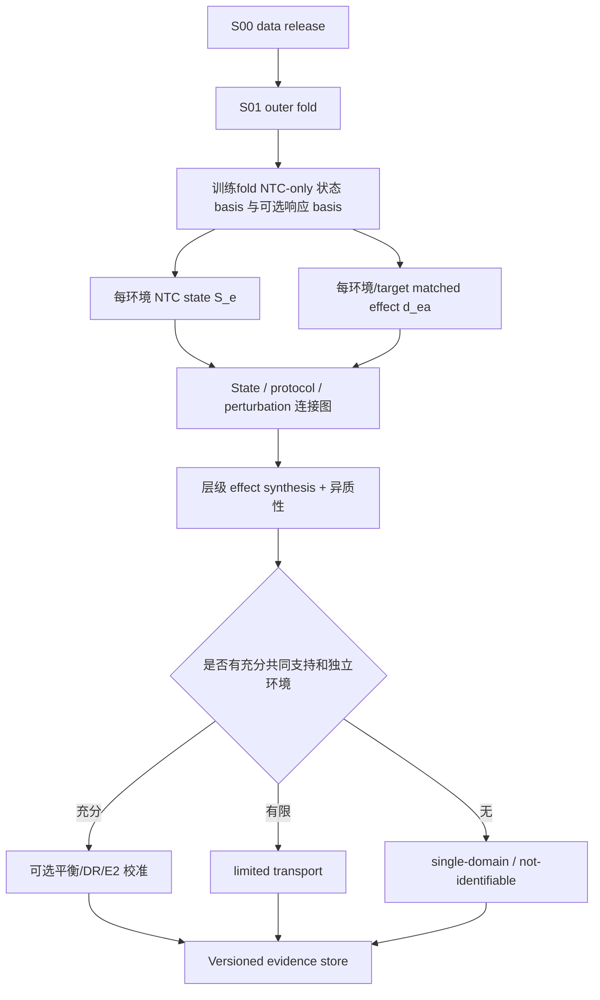

# S02 表征与跨环境证据设计

## 阶段定位

S02 把 S00 的单细胞数据转成后续模型真正可以使用的“状态与扰动证据”。它不是简单做一次 PCA，也不是把不同数据集强行 batch-correct 到一起，而是同时完成两件事：用 NTC 描述每个实验环境的初始状态，并用同环境 KD 与 NTC 的比较描述 perturbation response。

这一阶段决定了哪些跨 context 比较有数据支撑、哪些区域没有共同支持。后续 GRN 或 ODE 只能在这里允许的证据域内学习共享关系。

## 核心对象

对实验环境 `e = study × cell model × protocol × batch × replicate × time`，定义：

\[
S_e = \operatorname{Summary}(X_e^{NTC}),
\qquad
d_{e,a}=\mathbb E[\psi(X_{e,a})]-\mathbb E[\psi(X_e^{NTC})].
\]

- `S_e`：环境的 NTC 初始状态，不是需要被删除的 batch；
- `ψ`：在训练 fold 内拟合的 gene/program 表征；
- `d_{e,a}`：target `a` 在环境 `e` 中相对 matched NTC 的 condition-level response；
- 环境/replicate 是独立证据单位，单个 cell 只帮助估计该条件的分布和方差。

`d_{e,a}` 默认对应 `E1_assignment_itt`：在一个实验环境中，分配到 target/guide `a` 相对 NTC 的终点分布差异。它不是每单位实际敲低效应，不自动等于可运输效应，也不等于最终比赛预测分布。

## 因果对象与双 DAG

本阶段在任何估计前冻结两个问题图：

1. **实验内效应 DAG**：区分 target/guide assignment `Z`、实际敲低强度 `K`、预处理状态 `S`、终点表达 `Y`、扰动后质量/中介量 `Q_post` 和存活/捕获选择 `V`。
2. **跨环境运输 DAG**：区分 NTC state `S`、预处理/设计变量 `H_pre`、某 KD 是否在该环境被测到的 coverage、未记录协议偏差 `U` 和目标 NTC 状态分布。

对应四层 estimand：

| ID | 本阶段职责 |
| --- | --- |
| `E1_assignment_itt` | 默认生成 condition-level assignment effect 与不确定度 |
| `E2_knockdown_dose` | 仅在多 guide、强 first stage 和排除限制可辩护时生成可选剂量/`rho` 证据 |
| `E3_transport` | 定义目标 NTC 状态总体、支持域、可运输性和跨环境汇总 |
| `E4_prediction_distribution` | 只登记与下游预测接口的关系；实际生成属于 S03/S05/S06/S08 |

每个 estimand 同时登记统计单位、目标总体、允许调整集、分配假设、positivity、selection/interference 和禁止解释。E2/E3 不可识别时不妨碍 S03 为 E4 生成 fallback，但必须保留不可识别标签。

## 本阶段要回答的问题

1. 怎样把数万基因压缩成可解释、可跨数据集比较的 program state，同时避免留出 context 泄漏？
2. 每个 KD condition 是否有真正匹配的 NTC，匹配层级是否足够细？
3. 相同 perturbation 是否在多个初始状态、protocol 和 batch 中重复出现？
4. 哪些响应可以作为共享机制证据，哪些只能作为单域辅助信息？
5. 技术协变量不平衡能否通过稳定权重缓解，还是已经缺乏 positivity/overlap？
6. 哪些字段真正发生在扰动前，哪些是中介、选择变量或仅用于诊断，哪些假设因 pooled-culture 干扰或存活选择而无法验证？

## 输入与输出

| 类型 | 内容 | 本阶段产物 |
| --- | --- | --- |
| 输入 | S00 data release | raw/canonical cells、metadata、main/auxiliary 分流 |
| 输入 | S01 fold registry | 每个 outer fold 的训练/验证边界 |
| 表征输出 | fold-specific gene/program basis | PCA/NMF/cNMF basis、decoder 和稳定性报告 |
| 状态输出 | 每个环境的 NTC state `S_e` | 均值、协方差、cell 索引和 bootstrap uncertainty |
| 效应输出 | matched response `d_{e,a}` | gene/program effect、方差、guide 一致性和匹配来源 |
| 可运输性输出 | overlap/连接图 | shared、limited、single-domain、not-identifiable 分类 |
| 汇总输出 | hierarchical effect synthesis | shared term、state dependence、technical heterogeneity、prediction interval 与 leave-one-environment-out |
| 合同输出 | 双 DAG 与 E1-E4 registry | estimand、target population、adjustment set、selection/interference 和禁止解释 |
| 最终输出 | evidence store | 供 S03–S06 引用的带权重和 provenance 的证据发布版 |

## 核心实现方式

### 1. Fold 内 gene-program 表征

首版比较 PCA 与 NMF/cNMF 等简单、可解释的低维表示。用于定义 `S_e` 的主状态 basis 默认只用当前 outer fold 的训练 NTC cells 拟合；若使用全部训练 cells 学习响应 basis，必须作为独立视图保存并与 NTC-only basis 对照，不能无痕改变状态定义。留出 context 只能用冻结 basis 做 transform。为了避免几百万 cells 的大数据集支配表示，拟合时对 dataset、context 或 lineage 做配额采样，同时保留未加权对照。

PCA 提供稳定的线性基线，NMF/cNMF 提供更容易按正向 gene loadings 解释的 programs。program 数量 `K`、normalization 和 gene eligibility 都在训练 fold 内选择。除重构/稳定性外，还检查 program 对 dataset/context 的可预测性、`S_e` 与 `d_{e,a}` 的轴重叠、target 与 context 的混淆以及 NTC-only/all-cell basis 的差异；高相关是需要解释的纠缠诊断，不自动判为失败。完整 raw gene axis 仍保留，program space 只是建模视图。

### 2. 估计 NTC 初始状态

对每个 environment 保留 NTC cells 的 program 分布，而不只存一个均值。至少记录均值、协方差、样本量、bootstrap uncertainty 和 guide/batch 结构。这样后续模型既可以从多个 NTC cells 作为初始点生成分布，也可以用低维摘要判断两个环境是否处于可比较状态。

不同 NTC guide、replicate 或 batch 不会先被无条件合并。若它们之间差异很大，这本身就是 protocol/batch 诊断信号。

### 3. 构造 matched NTC response

每个 KD condition 只与同 study、cell model、batch/replicate 和 timepoint 的 NTC 比较。这个 E1 assignment contrast 可以去除对 KD 和 NTC 共同作用的加性背景偏移，但不能去掉 `KD × batch` 交互，也不能自动校正脱靶、扰动后存活/捕获选择或细胞间干扰。

Perturb-seq 不是对同一个 cell 做前后测量，因此不会把某个 KD cell 和某个 NTC cell 人工一一配对。输出是 condition distribution 的差异、bootstrap 方差和 guide 一致性；多 guide 若方向冲突，会被分开、降权或隔离，而不是先平均隐藏问题。

### 4. Overlap 与连接性审计

项目构造 `environment/state ↔ perturbation` 二部图。对每个 target，检查它出现于多少独立 contexts、是否有跨 protocol/batch 的桥接、这些环境的 `S_e` 是否具有局部共同支持，以及 cell model 与 batch 是否完全共线。

结果分为四类：

- `shared_evidence_candidate`：有真实跨环境重复和可比较状态支持；
- `limited_transport`：有重复但支持域窄或权重不稳定；
- `single_domain_only`：只能描述某个单独环境；
- `not_identifiable_metadata`：关键 metadata 缺失或状态与 batch 无法分离。

该分类决定数据能否约束共享模型，而不是评价 perturbation 本身是否重要。

### 5. 层级 effect synthesis 与条件平衡

每个 target/program 或候选边首先使用低维分层 meta-regression 汇总 condition-level evidence。共享项描述平均可迁移成分，NTC state 描述 effect modification，study/protocol/batch 只在交叉重复允许时作为技术项；报告环境异质性、预测区间、leave-one-environment-out、sign consistency 和单环境影响度。环境数少时限制 moderator 数量并使用收缩/小样本不确定度，不能由 cell 数扩充自由度。

只有 `shared_evidence_candidate` 且独立环境数、交叉重复和 positivity 足够时，才考虑 overlap weighting、entropy/kernel balancing 或稳定近似权重。权重以 condition/replicate 为单位，目标是在相近 NTC state 内平衡经 covariate-role registry 允许的预处理/设计变量；扰动后 QC、中介和选择变量不能进入默认调整集。

项目会同时检查未加权/逆方差层级模型与加权模型的 balance、weight range、effective sample size、单环境支配度、预测区间和 leave-one-environment-out 稳定性。若权重极端、ESS 太低或没有改善稳定性，就保留层级基线并把该 target 降为 limited transport。双重稳健摘要也只在独立环境数足够做 cross-fitting 时使用；guide-IV 只服务 E2/`rho` 校准；它们都输出低维 effect 和 uncertainty，不产生一张所谓“无混杂表达矩阵”。

### 6. Evidence store

最终每条 evidence 都能追溯到 fold、environment、target、estimand、target population、matched NTC cells、program basis、covariate-role manifest、allowed adjustment set、support class、层级汇总、各类权重、方差、guide/protocol、selection/interference 诊断和原始数据引用。后续模型看到的是原始分布加一份可审计证据表，而不是被覆盖后的单一矩阵。

## 工作流

## 人工需要决定什么

- program 表征是否足够稳定、可解释且不被大数据集主导；
- overlap 分类与不可运输区域是否接受；
- 极端权重或 metadata 共线的数据是否降级；
- 哪些 target/environment 获准作为共享证据进入后续阶段。

具体 schema、测试和支持域闸门见 [`AI_plan.md`](AI_plan.md)。

## 完成后实现了什么

S02 完成意味着后续模型获得了 fold-safe state representation、matched NTC effects、overlap 分类和 uncertainty-aware evidence store。它最多回答“现有数据能在什么范围检验共享机制”，不能说明 batch 已完全消除、共享机制已成立或某条 GRN 边具有因果性。
