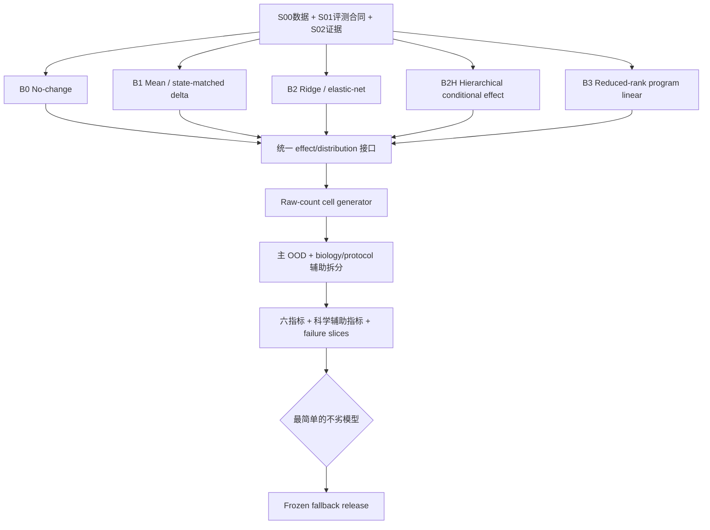

# S03 强基线与保底路径设计

## 阶段定位

S03 建立所有高级模型必须超过的性能下限，同时提前形成一条可提交、可回退的完整预测路径。它不是“随便跑几个简单模型”，而是要回答：如果 no-change、平均响应或线性映射已经能解释大部分可迁移信号，那么 GRN、ODE 和更深模型增加的复杂度是否真的必要？

基线与高级模型共用 S01 的 folds、指标和提交合同，也共用同一个 raw-count cell generator。这样比较结果才反映模型本身，而不是某一模型得到了更有利的预处理、输出后处理或评测方式。

## 本阶段要回答的问题

1. 只复制目标 context 的 NTC 分布，能够得到怎样的最低性能？
2. 训练 contexts 中某个 target 的平均 response，能否直接迁移到新 context？
3. NTC state 与 target identity 的线性关系，是否已足以预测 response？
4. 显式区分共享 target effect、state modification 和 study/protocol/lineage 异质性的层级模型是否已经足够？
5. 低维 program 空间中的 reduced-rank 映射，是否比全基因线性模型更稳定？
6. 怎样把 effect/mean prediction 转成官方要求的 400 个单细胞 raw counts？
7. 哪个最简单模型可以作为后续研发失败时的可靠 fallback？

## 输入与输出

| 类型 | 内容 | 本阶段产物 |
| --- | --- | --- |
| 输入 | S00 data release | 训练和验证所需的 raw/canonical 数据 |
| 输入 | S01 folds、六指标和 submission contract | 所有模型共用的公平评测框架 |
| 输入 | S02 state/evidence release | NTC state、matched effects、support 和 uncertainty |
| 模型输出 | B0–B3（含 B2H）baseline releases | 系数/operator、随机效应/异质性、配置、seed、fold predictions |
| 生成输出 | 通用 raw-count cell generator | 每 target/context 恰好 400 个稀疏 count profiles |
| 评测输出 | 分 context/target 的 OOD 报告 | 六指标、辅助指标、稳定性和失败切片 |
| 最终输出 | frozen fallback release | 后续复杂模型不可靠时仍可重放的保底路径 |

## 基线阶梯

| 层级 | 模型 | 它在检验什么 |
| --- | --- | --- |
| B0 | No-change / NTC resampling | 是否连 perturbation-specific signal 都没有恢复 |
| B1 | Matched/source mean delta | 是否只需把训练域的平均 response 搬到新 context |
| B2 | Ridge / elastic-net | state、target 和少量协变量的线性关系是否足够 |
| B2H | Hierarchical conditional-effect model | 共享 target effect、NTC state 与 study/protocol/lineage 异质性是否已足够 |
| B3 | Reduced-rank program linear | 共享低维 finite-time operator 是否足够 |

后续 S05 的共享线性机制和 S06 的非线性 GRN-ODE 都必须与这个阶梯在相同数据和评测条件下比较。

## 核心实现方式

### 1. B0：No-change

B0 不使用 target-specific response，只从目标 context 的 NTC 生成预测 cells。最直接的实现是按 NTC guide/细胞配额重采样；也可以拟合一个只保持 NTC gene-wise count statistics 的简单采样器。

这个模型看似“什么都没预测”，但在高维稀疏数据和弱响应 targets 上可能很强。它用于判断任何候选模型是否真正恢复了 perturbation signal，而不是只复现背景表达。

### 2. B1：Matched 或 mean delta

B1 从训练 contexts 中汇总同一个 target 的 matched NTC effect，再把该 effect 加到目标 context 的 NTC baseline。项目同时比较两种版本：

- 所有支持环境的 inverse-variance mean delta；
- 只在 S02 共同支持域内，根据 NTC state 邻近程度得到的 matched delta。

若 target 在训练域没有足够证据，模型必须显式回退 B0，并记录 coverage，而不是静默补一个平均值。

### 3. B2：Ridge / elastic-net

B2 把 target identity、NTC state 和允许的技术协变量映射到 gene/program response。Ridge 检验平滑的共享线性关系，elastic-net 允许更稀疏的特征选择。正则化只在 inner folds 选择，留出 context 的 response 不能参与。

该模型的系数可以帮助判断信息主要来自 target、state 还是 protocol，但系数本身不被解释为 GRN 边。

### 4. B2H：Hierarchical conditional-effect

B2H 对 condition-level effect 做低维部分池化：target 共享项和 NTC-state effect modification 是预测成分，study/protocol/lineage 项量化可识别的异质性。它输出环境间方差、预测区间、leave-one-environment-out 和 influence，而不恢复 GRN。环境数不足以估计某个随机项时，该项保持不可估计，不以 cell 数补自由度。

### 5. B3：Reduced-rank program linear

B3 在 S02 的 program space 中学习一个低秩 finite-time operator。它压缩了输出维度和参数量，检验“大部分可迁移 response 是否只发生在少数 gene programs 上”。

虽然它看起来像动力学映射，但这里只把它当作从 `z(0)` 到 `z(T)` 的有限时间线性预测器，不解释真实连续轨迹。

### 6. 通用 raw-count cell generator

比赛需要单细胞 counts，而许多基线只预测均值、delta 或 program effect。项目因此把“预测响应”和“生成单细胞分布”分成两层：

1. 模型先输出目标 context/target 的 expected effect 或 distribution parameters；
2. generator 从目标 NTC 的 cell/library structure 出发，应用 effect；
3. 使用 NTC residual bootstrap、Poisson/NB 或训练域拟合的 dispersion 生成 400 cells；
4. 执行非负、整数、library-size、zero fraction、gene order 和稀疏度检查。

rounding、clipping、renormalization 和 sparsification 都会改变预测，因此必须作为冻结流程评估，不能在提交前临时“修文件”。

### 7. 公平比较与 fallback 冻结

所有基线按 context/perturbation 汇总，而不是把几十万个 cells 当独立重复。报告不仅给 overall，还给每个 context、target、support class、seed 和 failure slice。若多个模型接近，优先冻结更简单、稳定、资源更低且 coverage 明确的模型。

## 工作流

## 人工需要决定什么

- B0–B3（含 B2H）的比较是否公平，是否存在 coverage、层级模型不可估计项或输出生成偏差；
- practical-effect 和“近似持平”阈值如何根据基线方差冻结；
- 哪个模型成为 fallback release；
- 是否已经有足够基线证据允许进入候选图和共享机制模型阶段。

详细参数、测试和冻结闸门见 [`AI_plan.md`](AI_plan.md)。

## 完成后实现了什么

S03 完成意味着项目至少有一条端到端、能生成官方格式、经过严格 OOD 比较的简单模型路径。复杂模型后续若不稳定或无增益，可以安全回退。基线胜出只表示额外复杂度尚未体现预测价值，不等于生物机制不存在。
