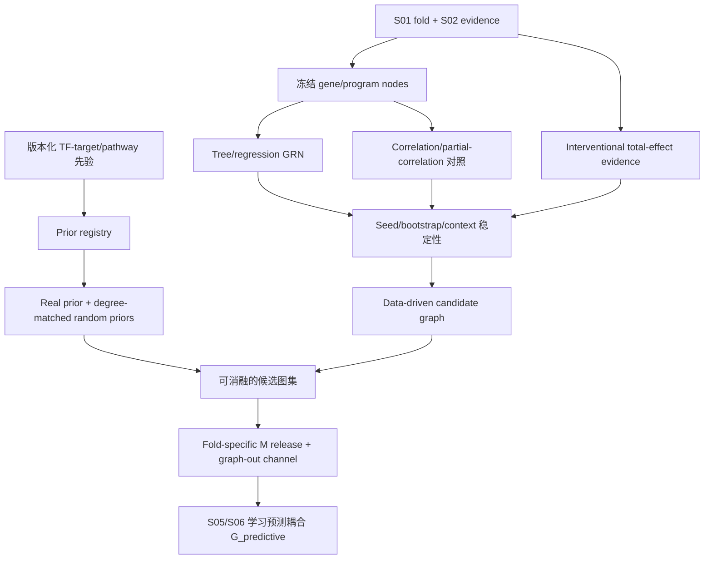

# S04 候选 GRN 设计

## 阶段定位

S04 为后续共享线性模型和 GRN-ODE 构造一个受控的候选连接空间 `M`，并整理独立的 `interventional_effect_evidence`。它解决的是“哪些边值得让模型去检验、哪些终点响应有干预支持”，而不是直接回答“哪些调控边是真的”。

若从全连接网络开始，参数量巨大，模型容易记忆 dataset/context；若直接采用知识图，又会把共表达、文献或数据库先验误写成机制。因此项目将图分成候选图、机制图和解释图三层，分别承担搜索空间、预测学习和事后注释职责。

## 四类对象的职责

| 图层 | 如何得到 | 用途 | 不能代表什么 |
| --- | --- | --- | --- |
| 候选图 `M` | 训练 fold 数据、perturbation evidence、版本化先验 | 限制/初始化后续可学习边 | 不是最终预测图 |
| `interventional_effect_evidence` | S02 E1/E3、层级汇总、异质性与支持域 | 记录 target assignment 对终点的总效应证据 | 不是直接调控图 |
| 预测耦合 `G_predictive` | S05/S06 在 OOD 预测目标下学习 | 表示模型中的有效共享耦合 | 不自动等于直接 TF-target 因果边 |
| 解释图 | 训练后叠加文献、TF-target、pathway 标签 | 解释与冲突提示 | 不能反向覆盖数据结果 |

## 本阶段要回答的问题

1. gene-level 和 program-level 分别需要哪些节点，如何保持二者映射清晰？
2. 哪些候选边在不同 seed、bootstrap 和 contexts 中稳定出现？
3. perturbation response 是否为终点总效应、状态依赖或跨 context 共享性提供支持，且其异质性是否落在预注册等效范围？
4. 外部 TF-target/pathway 先验怎样进入而不控制最终结论？
5. 真实先验是否能与 degree-matched 随机图做公平比较？
6. 哪些强假设方法只适合作为辅助 edge score？

## 输入与输出

| 类型 | 内容 | 本阶段产物 |
| --- | --- | --- |
| 输入 | S01 fold registry | 每个 fold 独立构图的边界 |
| 输入 | S02 program state、matched effects、support classes | 数据和 perturbation edge evidence |
| 输入 | 本地、许可清晰的 TF-target/pathway 资源 | versioned prior registry |
| 中间输出 | 各方法 edge tables | correlation、tree/regression GRN、perturbation scores |
| 对照输出 | no-prior、real-prior、randomized-prior 图集 | 后续图价值消融 |
| 最终输出 | fold-specific candidate graph/evidence release | nodes、edges、interventional evidence、分数、来源、许可和 graph-out 通道 |

## 核心实现方式

### 1. 冻结节点宇宙

每个 outer fold 只从训练数据确定可用 genes/programs。gene-level 图用于表达较细的候选关系，program-level 图用于低维动态建模；二者通过 gene-program loading 映射，但不会把 program coupling 直接展开成大量“已确认”基因边。

source 节点优先考虑 TF、调控因子和可解释 programs，target 节点覆盖训练 feature universe。比赛的 300-target panel 不能成为唯一选点依据，否则会把官方 validation 信息带入训练设计。

### 2. 数据驱动候选生成

首版至少比较一类树/回归型 GRN 方法（如 GENIE3/GRNBoost2）和一个简单 correlation/partial-correlation 对照。它们都只在 training fold 的 NTC 或 condition-level data 上运行，并使用 context/lineage 配额，避免最大数据集支配边排序。

不同方法对“方向”的含义不同：树模型的 feature importance、相关性和 perturbation response 不能混成同一个分数。项目保留 per-method edge table，再在冻结规则下合并。

### 3. 加入 perturbation edge evidence

S02 的 matched E1/E3 effects 提供比共表达更接近干预的终点总效应证据。对候选 source→target/program，统计 total-effect support、符号一致性、state interaction、层级异质性、prediction interval、protocol stability 和 leave-one-environment-out influence。

“跨 context 稳定”不能由异质性检验不显著直接赋值。项目预先冻结 practical-equivalence 界值、最低环境覆盖与 prediction-interval 规则；多边探索性检验控制 FDR。ICP/JCI 若在 T00 被选中，只作为额外不变性候选分数，不能替代上述 effect/heterogeneity 证据。

只有处于共同支持域且通过预注册覆盖/异质性规则的 environments 才能获得 cross-context stable evidence；单域响应可以增强局部候选，但不能贴上“跨 context 共享”标签。不同时间点只有在设计、剂量和协议可比时产生 `temporal_support`，不能由跨 study 的最早响应单独推断直接边。图外仍保留小配额 discovery channel，避免候选生成器把真正新边永久挡掉。

### 4. 稳定性选择

在每个 training fold 内改变 seed、bootstrap cells/conditions 和 context subsample，观察边的 selection frequency、rank 和 sign 是否稳定。候选图的边预算按全图和每节点同时限制，避免叠加多个算法后模型容量无限增长。

稳定性低不一定说明边不存在，但意味着它不适合作为强约束，可被降为弱 prior 或保留在 graph-out 通道。

### 5. 外部知识先验

每个知识资源登记来源、版本、物种、证据类型、许可和 gene mapping。先验最多用于三种位置之一：补充候选边、初始化、或降低 soft penalty。真实先验之外必须生成 degree-matched randomized priors，保持节点、边数和度分布大致一致。

这样后续若真实图优于随机图，才说明增益可能来自知识内容，而不只是“给模型加了一张图”。

### 6. 强假设辅助分数

BackShift 等多环境方法只有在相同节点至少出现在三个充分不同 environments、线性化合理、shift-intervention 和隐藏混杂稳定假设可检查时才运行。输出只是 `optional_backshift_score`，不直接决定边，也不替代非线性 ODE。

## 工作流

## 人工需要决定什么

- 节点层级和边预算是否合理；
- 候选合并规则与 graph-out 配额是否足以避免先验锁死；
- 外部资源的许可和证据类型是否允许使用；
- BackShift 等强假设支路是否具备运行条件；
- candidate graph release 是否获准进入 S05。

边 schema、构图测试和发布闸门见 [`AI_plan.md`](AI_plan.md)。

## 完成后实现了什么

S04 完成意味着每个 fold 都有一组可追溯、容量受控、可与随机图比较的候选边，以及不冒充直接调控的干预总效应证据表。它降低后续模型搜索难度，但任何候选边和直接调控关系仍是 `not_tested` 或 `unresolved`；只有后续 OOD 预测和消融能判断候选结构是否有用。
