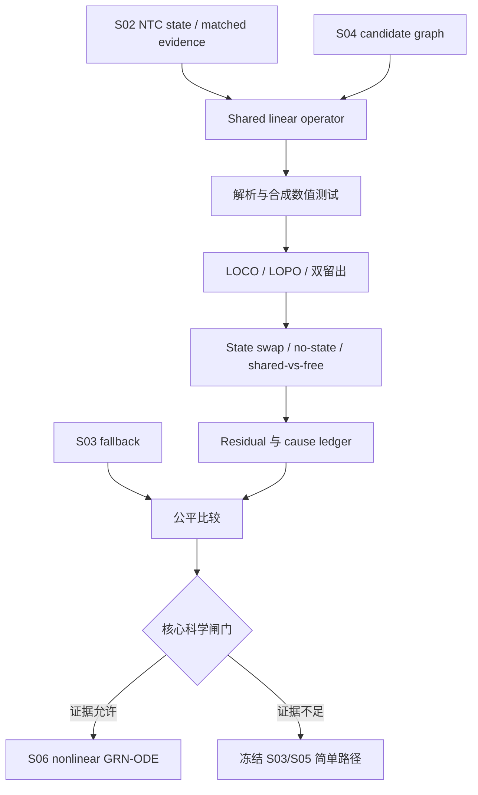

# S05 共享线性机制设计

## 阶段定位

S05 是项目第一次直接检验“NTC 初态可变、响应机制共享”这一核心假设。它使用低容量线性模型，是因为在进入非线性 GRN-ODE 前，需要先确认最简单的共享机制是否已经能跨 context 迁移。

如果线性模型连强基线都不能稳定超过，就没有充分理由直接增加深度、非线性或 mixture-of-experts。反过来，如果线性共享模型在 LOCO 中有一致增益，它会为 S06 提供明确的起点和残差结构。

## 模型在做什么

对每个目标 context，从它的 NTC cells 得到多个初始 program states `z(0)`，并对 target gene 构造 soft intervention `u_a`：

\[
\frac{dz}{dt}=Gz+Qu_a,
\qquad
z(T)=\Phi_T z(0)+\Gamma_Tu_a.
\]

- `z(0)` 随 context 的 NTC 改变；
- `G_predictive/Q` 或等价的 finite-time operator 在训练 contexts 间共享；
- `u_a` 表示 CRISPRi 强度，不把 knockdown 当成完美 knockout；
- decoder/generator 把 `z(T)` 转回 gene-level 单细胞 raw counts。

单终点数据主要约束 `z(0) → z(T)` 的有限时间映射，不保证连续生成矩阵 `G` 唯一。因此本阶段检验的是共享有限时间响应结构，而不是恢复真实生物轨迹。

## 本阶段要回答的问题

1. 只改变 NTC 初态、共享同一个线性 operator，是否能预测未见 context？
2. 候选图约束是否帮助预测，还是只是增加结构偏好？
3. 模型是否真正使用正确 NTC state，而不是只记住 target 的平均 effect？
4. 共享模型相对 per-context 自由模型损失多少训练内拟合、换来多少 OOD 泛化？
5. 失败来自共享假设、数据 overlap、数值实现、表示/decoder，还是 count generator？

## 输入与输出

| 类型 | 内容 | 本阶段产物 |
| --- | --- | --- |
| 输入 | S02 state/evidence release | `z(0)`、matched effects、support、weights 和 uncertainty |
| 输入 | S03 fallback release | 必须超过的强基线与通用 count generator |
| 输入 | S04 candidate graphs/evidence | 每 fold 的 mask/soft penalty、interventional evidence 与无图对照 |
| 模型输出 | Shared linear checkpoints | operator、intervention map、decoder 接口和配置 |
| 诊断输出 | State swap、shared-vs-free、residual analyses | 判断模型是否使用 state、残差由什么解释 |
| 科学输出 | Core hypothesis gate report | 对受限共享 operator 子主张给出证据状态 |

## 核心实现方式

### 1. 共享参数与 soft intervention

所有训练 contexts 共用同一组动力学/finite-time 参数，context identity 不进入可学习 embedding。context 差异只能通过 NTC-derived state 和明确允许的技术协变量进入。

target gene 通过 gene-program mapping 形成 `q_a`；`u_a=-ρq_a`。`rho_source` 必须区分 `measured`、`S02_E2_calibrated` 和 `bounded_learned`；guide-IV 只有通过 S02 E2 识别闸门后才能提供校准。否则 `ρ` 在合理范围内受约束地学习，避免模型用无限 intervention strength 弥补其他错误。

### 2. Candidate graph 只作约束

S04 的 `M` 可以限制 `G_predictive/Q` 的可学习位置或提供 soft penalty，`interventional_effect_evidence` 只提供 effect/support/uncertainty 输入；项目同时保留 data-only/no-prior 对照。候选图或总效应证据不会直接被复制成模型权重，真实 prior 的增益也留给后续随机图消融判断。

### 3. 训练目标

主目标是解释 S02 的 matched condition effects，并按 inverse variance、support 和数据采样权重调整贡献。target knockdown direction、稀疏性和低秩约束作为结构项；bridge loss 只作用于真正有跨环境共同支持的 targets。

证据权重与 bridge regularization 有不同职责：前者定义 condition 证据的目标总体/可信度，后者限制模型对预注册环境 shift 的敏感性。两者分开保存并检查 effective sample size、loss scale 和 influence，必须比较无 balance weight、无 bridge、二者同时存在的消融，避免单一 environment 或重复鲁棒化主导训练。

默认 anchor 只使用有明确技术语义的 study/protocol/batch 变量；cell line/lineage 含真实生物 effect modification，不能自动作为必须消除的 nuisance anchor。若将 biological context 用作压力测试 anchor，需单独配置、inner-fold 选择并报告 state signal 是否被压制。S07 adapter 的 outer-fold 结果不能返回重调 S05 gamma；任何 joint tuning 必须预注册并只发生在 inner folds。

### 4. 数值与解析验证

线性模型具有解析终点，可用 matrix exponential 或等价 closed-form 对实现做强校验。测试包括 zero intervention、单 program、带反馈但稳定的系统、near-unstable 参数、candidate mask、CPU/GPU 一致性和直接 one-step/operator 等价场景。

同时构造反例：context-specific mechanism、`KD × batch` 交互或 state 无关 response，检查诊断工具是否能发现共享假设的失效方式。

### 5. OOD 训练与反事实诊断

模型按 S01 的 LOCO、LOPO 和双留出运行。在 state swap 中，把 response target 与错误 context 的 NTC 对换：若预测几乎不变，说明模型没有真正使用 state。还会比较：

- no-state 模型：判断 state 是否带来信息；
- free per-context 模型：只作训练内容量上限，不能用于真正未见 context；
- S03 reduced-rank one-step：区分共享低维映射与线性 ODE 参数化的贡献。

Residual analysis 将误差按 support class、target、protocol/batch、state 和 generator 分解，为 S06 是否值得启动提供原因，而不是只看一个 overall score。

### 6. 核心科学闸门

项目比较 context/target-level paired differences、多个 folds/seeds 和实际效应门槛。可能的路线包括：

- 共享线性模型稳定优于基线且 state 诊断成立：允许进入 S06；
- 有 state 信号但线性表达能力可能不足：可申请诊断性非线性升级；
- 增益不稳定或被数据/support/数值问题解释：保持 `unresolved` 或 `weakened`，回退 S03；
- 只有注册 estimand 已测且替代原因被排除时，才能用 `falsified`。

## 工作流

## 人工需要决定什么

- dry run 的数值、资源和共享参数边界是否可信；
- 全 folds 长时运行是否获批；
- failure cause ledger 是否足以排除实现/数据替代解释；
- scientific verdict 及 S06 是否获得授权。

模型接口、损失、测试和闸门细节见 [`AI_plan.md`](AI_plan.md)。

## 完成后实现了什么

S05 完成意味着核心假设已经接受一次最小、严格的 OOD 检验，并形成可重放的线性共享模型或有证据的回退决定。即使结果良好，也只支持“受限共享有限时间 operator 对本任务有预测价值”，不能确认完整 GRN、直接因果边或真实连续轨迹。
