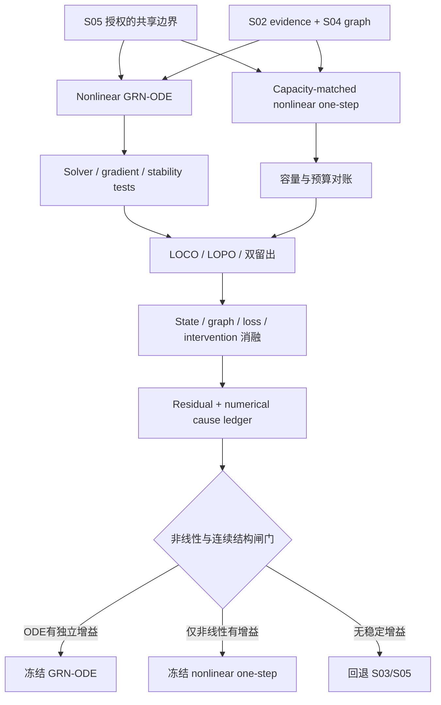

# S06 共享非线性 GRN-ODE 设计

## 阶段定位

S06 只有在 S05 的核心科学闸门明确授权后才启动。它用于检验：在共享机制已经表现出一定可迁移价值的前提下，非线性响应、反馈结构和连续 vector field 是否提供额外且稳定的 OOD 增益。

本阶段不是把模型“做深”作为默认目标，而是把两个问题分开：非线性是否有用，以及连续时间参数化是否有用。为此，nonlinear GRN-ODE 必须和同容量 nonlinear one-step 模型比较。

## 主模型在做什么

\[
\frac{dz}{dt}=A\,\sigma(Bz+b+u_a)-\Lambda z,
\qquad
G=AB.
\]

- `z(0)`：目标 context 的多个 NTC program states；
- `Bz+b+u_a`：当前状态和 soft CRISPRi intervention 共同驱动调控响应；
- `σ`：允许 response 随 state 非线性变化；
- `A/B`：低秩结构控制容量，`G_predictive=AB` 表示模型中的有效 program coupling；
- `Λz`：衰减/稳定项，主要用于限制数值发散；
- 所有动力学参数跨 contexts 共享，context identity 不能成为可记忆 embedding。

实验通常只有终点，所以 `T` 主要是有限时间尺度约定。即使使用 ODE solver，也不能自动把中间积分点解释成真实生物轨迹。

## 本阶段要回答的问题

1. 非线性模型是否稳定超过 S05 共享线性模型？
2. 在参数量、输入、decoder 和训练预算匹配时，ODE 是否超过 nonlinear one-step？
3. 候选图、soft intervention、bridge loss 和 state input 分别贡献什么？
4. 数值 solver 的误差、stiffness 或优化失败是否会伪装成科学失败？
5. 更复杂模型的收益是否足以抵偿训练成本、seed 不稳定和解释风险？
6. E3 运输证据、S04 干预总效应证据与模型的 E4 预测输出是否保持语义分离？

## 输入与输出

| 类型 | 内容 | 本阶段产物 |
| --- | --- | --- |
| 输入 | S05 gate decision 和 frozen linear model | 非线性升级理由与公平比较基线 |
| 输入 | S02 state/evidence、S04 candidate graph | 初态、weighted evidence 和图约束 |
| 模型输出 | Nonlinear GRN-ODE checkpoints | vector field、solver、decoder 和配置 |
| 对照输出 | Capacity-matched nonlinear one-step | 隔离连续结构的额外价值 |
| 诊断输出 | Solver、gradient、state、graph 和 residual reports | 区分数值/实现与科学原因 |
| 决策输出 | Nonlinearity/continuity gate report | 冻结 ODE、回退 one-step/linear 或回退 baseline |

## 核心实现方式

### 1. 受限的 nonlinear vector field

模型在 S02 的低维 program space 工作，通过低秩 `A/B`、稀疏候选 mask 和稳定项控制参数量。activation、rank 和 state dimension 都在 inner folds 内选择，不能为某个 outer validation context 单独调整。

soft intervention `u_a=-ρq_a` 沿用 S05 的定义，以免通过改变干预表达方式制造不公平增益。context 差异仍只来自 NTC state；adapter 和 MoE 留给 S07 的独立门控分支。

### 2. ODE solver 与数值验证

项目优先复用成熟 solver，并在小系统上比较固定步长和自适应方法。需要明确记录 tolerance、max steps、dtype、gradient/adjoint 方式、failure policy 和 solver 调用数。

解析或高精度参考系统用于检查 forward error；有限差分用于检查 gradient。NaN、Inf、max-step、stiffness 和 gradient explosion 都是显式失败，不能静默 clipping 后继续评分。若调整 tolerance 能显著改变模型排名，科学结论必须保持 `unresolved`。

### 3. Loss 与单细胞生成

主损失沿用 S05 的 matched effect、support 和 uncertainty 权重；必要时增加 count likelihood、MMD 或 Sinkhorn 中一个预注册的 distribution loss。每个 loss 项可独立关闭并报告梯度尺度，避免多个 loss 一起加入后无法解释增益。

模型可以输出终点 program/gene distribution 参数，再通过 S03 的通用 generator 生成 raw counts。若另学一个 distribution decoder，它增加的容量必须单独对账，并与固定 generator 比较。

### 4. 同容量 nonlinear one-step

one-step 模型使用相同的 `z(0)`、target input、candidate mask、parameter-count range、decoder 和训练预算，但直接学习 `z(0) → z(T)`。它不经过 ODE 积分。

如果 nonlinear one-step 与 ODE 表现相当或更好，说明非线性可能有价值，但连续结构没有证明额外价值；此时应保留 one-step，而不是因为 ODE 更符合原始故事就强行选择 ODE。

### 5. 全 folds 与结构消融

所有运行按 S01 的 LOCO、LOPO 和双留出执行，并比较：

- S03 fallback；
- S05 shared linear；
- nonlinear one-step；
- nonlinear GRN-ODE。

另外逐项关闭 state input、candidate graph、soft intervention strength、bridge loss、sparsity/low-rank。每项增益必须跨 contexts/folds/seeds 稳定，并结合 support class、solver failure 和 generator diagnostics 解释。

### 6. 保留或回退

最终分别判断两个子主张：`nonlinearity_adds_ood_value` 与 `continuous_structure_adds_ood_value`。可能的结果是：

- ODE 稳定优于 one-step/linear：冻结 nonlinear GRN-ODE；
- 非线性有增益但 ODE 无增益：冻结 nonlinear one-step；
- shared linear 不劣：回退 S05；
- 复杂模型全面不稳或无增益：回退 S03 fallback。

回退是正式结果，不是工程失败。

## 工作流

## 人工需要决定什么

- S05 是否提供了足够的进入理由；
- solver、资源预算和 dry run 是否获准扩展到全 folds；
- one-step 是否真正容量匹配；
- 两个 scientific sub-claims 的证据状态，以及最终保留/回退路线；
- 是否存在足以触发 S07 某个扩展分支的残差。

模型、solver、测试和闸门细节见 [`AI_plan.md`](AI_plan.md)。

## 完成后实现了什么

S06 完成意味着项目已经独立检验了非线性和连续结构的预测价值，并冻结最简单的不劣路线。即使 ODE 获保留，也只支持有限时间 E4 生成结构在注册 OOD 任务中的价值，不支持 E1/E2/E3 已被充分识别、中间轨迹、长期稳态或直接 GRN 边已被识别。

<!-- File structure: nonlinear predictive model, numerical boundary, E1-E4 interface, fair controls, diagnostics and scientific gate. -->
