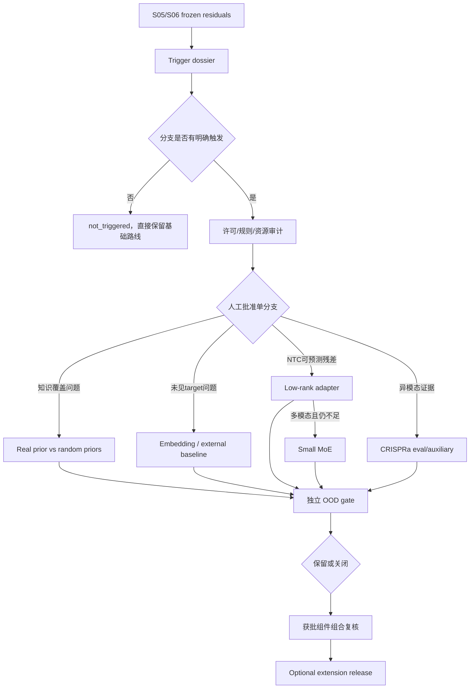

# S07 有门控扩展设计

## 阶段定位

S07 是条件式扩展阶段，不是必经的“大模型阶段”。只有 S05/S06 留下稳定、可复现且已有初步原因定位的 E4 预测残差时，才为相应问题增加额外信息或容量。若没有触发证据，S07 可以零分支结束，项目直接进入 S08。

每个扩展都被当成一个独立科学/工程假设：先说明它要解决哪个残差，再限制资源和比较对象，最后决定保留或关闭。扩展只针对冻结的 E4 预测残差，不重新定义 S02 的 E1-E3 estimand，也不把预测增益升级为干预或直接调控证据。这样可以避免同时加入知识图、embedding、adapter 和 MoE 后，即使分数变化也不知道是哪一部分造成的。

## 分支及触发逻辑

| 分支 | 只有什么证据出现才考虑 | 主要比较 |
| --- | --- | --- |
| 知识图 soft prior | data-only 图稳定，但长尾/稀疏区域有系统误差且 prior 有覆盖 | real prior vs degree-matched random priors |
| 冻结 embedding / 外部 baseline | 未见 target 是主要残差，且合法模型/embedding 可用 | embedding vs one-hot/简单 gene features |
| 低秩 NTC adapter | `G_predictive` 的 E4 残差可被 NTC state 稳定预测，且不是支持域/协议问题 | adapter off vs 受限 adapter vs permuted-context adapter |
| 小型 MoE | 受限 adapter 仍不足，残差呈 NTC 可预测的多模态结构 | MoE vs 受限 adapter，容量/预算匹配 |
| CRISPRa/异模态辅助 | 需要方向分离的外部证据且模态/许可明确 | CRISPRi-only vs 显式 modality-aware 辅助训练 |

`not_triggered` 只表示没有启动理由，不表示方法被科学否定。

## 输入与输出

| 类型 | 内容 | 本阶段产物 |
| --- | --- | --- |
| 输入 | S05/S06 frozen residuals 与 cause ledger | 每个分支的触发依据 |
| 输入 | S04 prior/random graph assets | 知识图分支的公平对照 |
| 输入 | 合法的本地代码、权重、embedding 或辅助数据 | 版本化 license/rules registry |
| 分支输出 | 独立 run namespace 与报告 | 每个分支自己的配置、预算、结果和失败证据 |
| 决策输出 | 保留/关闭/未触发状态 | 明确 scientific sub-claim 和原因 |
| 最终输出 | 可选 extension release | 只组合已独立通过闸门的组件 |

## 通用实施模板

每个分支都按同一顺序执行：

1. **Trigger**：用 frozen residual 说明具体要解决的问题；
2. **Compliance**：确认数据、代码、权重、商业/竞赛许可和 finalist 披露要求；
3. **Comparator**：冻结最简单对照和容量/预算；
4. **Dry run**：验证接口、资源、seed 和失败路径；
5. **OOD evaluation**：沿用 S01 folds 和 S03 generator；
6. **Gate**：跨 contexts/folds 判断保留、关闭或仍未解决；
7. **Combination check**：只有单分支获批后，才测试与其他分支组合。

分支不能共享 outer validation 结果做无限次搜索，所有尝试和关闭结果都要记录。

## 各分支具体做法

### 1. 知识图 soft prior

真实 TF-target/pathway 图只能在 mask、initialization 或 penalty 中选择一个预注册位置注入。项目同时训练 no-prior 和多个 degree-matched randomized-prior 对照，并保持节点、边数、参数量、fold 和 seed 相同。

真实 prior 只有稳定超过随机图分布，才能说明知识内容可能有增益；仅优于无图可能只是图正则本身的容量效果。prior-supported edge 仍不升级为因果边。

### 2. 冻结 embedding 或外部预测 baseline

Geneformer、TxPert、AROMA 或其他合法资产先作为外部 baseline 或冻结 target feature 接入。首先比较 one-hot、简单 gene annotations 和 frozen embedding；只有 frozen feature 在严格 LOPO/双留出中有增益，才考虑更昂贵的 fine-tuning。

外部模型输出不能成为主模型的“真实标签”，也不能通过文献结果逐 target 修正提交。

### 3. 低秩 NTC-driven adapter

adapter 的输入 `h_c` 只由目标 context NTC 汇总得到，用一个低秩、低幅度 residual 修正共享 vector field：

\[
f_c(z,u)=f_{shared}(z,u)+R_\phi(h_c;z,u).
\]

它与 adapter-off、context-permuted adapter 和训练内 free per-context 上限比较。若 adapter 使用真实 context ID、在 outer validation residual 上训练后回测同一 fold，或 residual 主要来自 protocol/support 问题，则该分支不成立。

### 4. 小型 MoE

MoE 只在受限 adapter 已有正向证据但仍无法表示多个 NTC 可预测模式时启用。gating 只能看 NTC state，experts 数和总参数量受限，并检查 expert collapse、load imbalance、context memorization 和 seed instability。

MoE 必须超过受限 adapter，而不是只超过最初 shared model；否则额外专家没有独立价值。

### 5. CRISPRa 与异模态辅助证据

CRISPRa、KO、药物和组合扰动默认保持独立分支。若联合训练，必须显式编码 modality 和方向，并与 CRISPRi-only 模型消融比较。它们可以帮助 representation 或提供外部方向诊断，但不能与 CRISPRi effect 直接平均。

## 规则与许可边界

所有外部资产都需记录 source、version、license、竞赛/商业用途和披露义务。官方规则同时包含 ML-only 要求和对 mechanistic/non-learned components 的披露要求；若最终输出直接混入纯手工机制或人工融合权重，需先取得主办方书面澄清。

## 工作流

## 人工需要决定什么

- 每个 trigger 是否真的来自 frozen residual，而非结果后脑补；
- 外部资产的许可和 ML-only 边界是否允许；
- 每个分支的资源预算与比较对象；
- 单分支是保留、关闭还是仍为 unresolved；
- 多个获批组件是否允许组合进入 S08。

具体触发、预算、分支测试和发布闸门见 [`AI_plan.md`](AI_plan.md)。

## 完成后实现了什么

S07 完成意味着所有被触发的扩展都获得了独立、可审计的结论，并且最终 release 只包含真正有 E4 OOD 增益且合法可披露的组件。没有触发任何分支也是完整结果；保留某一扩展只支持其预测价值，不把 knowledge、embedding、adapter 或 expert 参数解释成 E1/E2/E3 因果机制。

<!-- File structure: extension triggers, compliance, E4 residual scope, branch comparisons and release gate. -->
