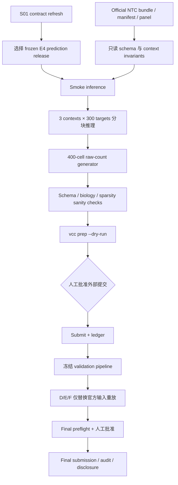

# S08 竞赛推理与提交设计

## 阶段定位

S08 把已经在内部冻结的模型转化为可验证、可提交、可归档的比赛交付物。它的重点不是继续研发模型，而是保证匿名 context 的 NTC 被正确读入、预测严格由冻结管线产生、输出满足官方 raw-count 契约，并且 validation 到 final 的流程可以原样重放。

这一阶段同时保护科学边界：官方格式通过、成功上传或 leaderboard 分数属于竞赛 workflow evidence，不能替代外部数据上的 LOCO 科学验证。S08 的主要交付对象是 `E4_prediction_distribution`；它可以在 E2/E3 不可识别时由获批 fallback 生成，但不能反向支持 E1/E2/E3 或直接 GRN 主张。

## 当前提交对象

截至已有官方快照，每一轮包含三个匿名 contexts：validation 为 A/B/C，final 为 D/E/F；同一轮共享 300-target panel。当前公开合同要求每个 target/context 生成 400 cells，完整预测为 360,000 cells × 18,533 genes 的稀疏、非负、整数意义 raw counts。

这些数值是执行前需要重新核验的官方合同，不是永久硬编码。真正运行时以 authenticated bundle、当时的 Rules/CLI/scorer 和 `vcc prep --dry-run` 为准。

## 本阶段要回答的问题

1. 哪个 frozen model release 应根据内部 OOD 证据进入比赛推理？
2. 如何保证 A/B/C 或 D/E/F 的 context labels、gene order 和 target panel 不被误换？
3. 怎样把模型输出稳定地生成每 target 400 个单细胞 raw counts？
4. 如何在大规模生成中恢复单个 context/target，而不覆盖失败证据？
5. 怎样证明提交文件通过 schema、稀疏度、library-size 和官方 CLI 检查？
6. validation 后如何冻结流程，使 final 只替换 bundle 而不临时改模型？
7. 每次提交和 finalist 方法披露需要保存哪些 provenance？

## 输入与输出

| 类型 | 内容 | 本阶段产物 |
| --- | --- | --- |
| 模型输入 | S03 fallback 及获批的 S05/S06/S07 releases | 由内部 OOD 协议选择的 frozen E4 prediction model |
| 官方输入 | Authenticated NTC H5AD、manifest、gene list、target panel | 只读 inference input manifest |
| 推理输出 | 每 context/target 的 effect/distribution 与 400 cells | 可分块恢复的预测单元 |
| 文件输出 | 完整 prediction H5AD 和 `.vcc` | 通过内部 tests 与 official dry-run 的包 |
| 操作输出 | Submission ledger | entry、artifact/model/data/seed/CLI/scorer stamps 和结果 |
| 归档输出 | Frozen validation pipeline、final audit、method disclosure | 可重放和可公开说明的交付链 |

## 核心实现方式

### 1. 刷新规则并选择模型

进入 validation、进入 final 以及最终提交前，都重新核验 Rules、Data、Evaluation、FAQ、CLI 和 scorer release，并与 S01 contract 做 diff。官方冲突保留证据；若 schema-critical 规则变化，先修订合同而不是直接改输出文件。

候选模型只来自已经通过人工闸门的 frozen releases。选择依据是 S01 预注册的内部 OOD 比较，优先最简单的不劣模型。Leaderboard 可以记录，但不能反向决定 feature、graph、hyperparameter、blend 或 target-specific patch。

### 2. 只读读取匿名 NTC bundle

从官方 manifest 读取 partition、contexts、panel 和 gene order，对 H5AD 检查 raw counts、shape、NTC IDs 和 labels。A/B/C 或 D/E/F 标签原样贯穿推理，不能按 UMAP 聚类猜测或重命名 context。

目标 context adaptation 若存在，只能使用它的 NTC，并且必须已在内部 LOCO 中模拟验证。真实 context identity 和 hidden response 都不可用。

### 3. 参数化、可恢复的批量推理

先运行一个 context × 少量 targets 的 smoke test，再扩展到完整 `3 × 300` 单元。每个 context/target 有独立状态、确定性派生 seed、runtime、model/checkpoint ID、library/distribution diagnostics 和输出路径。

这样某个 target 失败时只需恢复该单元，同时保留首次失败，不必覆盖整个提交。大矩阵按 chunks 生成和拼接，并在每批释放 NTC/model intermediates，避免内存峰值。

### 4. Raw-count 生成与 sanity checks

冻结的 model + generator 把内部 gene/program distribution 转成每单元恰好 400 个 raw-count cells。检查包括：

- finite、non-negative、integer-valued；
- 官方 gene order、context/target labels 和完整 panel；
- 无 NTC rows、每组 cell cardinality 正确；
- library size、zero fraction、expressed genes、mean/variance 无异常；
- sparse stored entries 和总 cells 不超当前官方上限。

异常单元按预注册规则重跑或回退 frozen fallback。任何 clipping、rounding、renormalization 和 sparsification 都必须是内部验证过的模型流程，不能由人手逐 target 修数。

### 5. 官方 dry-run、封装与人工提交

完整 H5AD 先通过内部反向 schema tests，再用锁版 `vcc prep --dry-run` 检查。只有二者都通过，才生成 `.vcc` 并向用户展示 model/delivery ID、artifact checksum、partition/panel、CLI version、剩余提交额度和 fallback。

外部 `vcc submit` 每次都需要用户明确批准。提交后 ledger 保存 entry ID、时间、artifact/model/data/seed/CLI/scorer versions、partition、panel、anchor set、状态和六项指标；外部失败不会自动反复消耗额度。

### 6. Validation 冻结与 Final 重放

A/B/C validation 完成后，冻结整个 pipeline：代码、环境、模型、generator、schema、seeds、configs 和已知限制。D/E/F final 只允许替换官方 bundle、contexts、panel 和 manifest。

如果 final bundle 暴露出共享实现 bug，修复必须在 validation fixture 上回归；不能增加 final-only target 规则或根据匿名 context 猜测模型。

### 7. 最终归档与方法披露

最终归档从 S00 data release 一直追踪到 `.vcc` artifact，保存所有阶段 gate、失败/回退、许可和隐藏标签边界。同时自动形成 finalist-ready 的高层方法说明：训练数据、预处理、模型/公开资产、统计或机制组件、训练/推理流程、compute 和人工环节。

最终报告分别给出 `workflow_verdict` 和逐主张的 `scientific_verdict`。成功提交或排名不会自动升级科学主张。

## 工作流

## 人工需要决定什么

- 当前官方 contract diff 是否可接受；
- 哪个 frozen release 进入 validation/final；
- 完整推理的资源预算和异常 fallback；
- 每一次外部提交是否批准；
- validation 后任何方法变化是否仍符合隐藏标签和 ML-only 边界；
- 最终 workflow/scientific claims ledger 是否批准归档。

提交不变量、失败恢复和具体闸门见 [`AI_plan.md`](AI_plan.md)。

## 完成后实现了什么

S08 完成意味着项目拥有一个由冻结模型产生、通过当时官方校验、可追溯到全部上游 releases 的 E4 提交，以及完整 submission ledger、method disclosure 和最终审计。它证明交付链完成；E4 预测价值仍只能由内部预注册 OOD 证据支持，不能由上传成功或榜单排名单独决定，也不能升级 E1/E2/E3 或直接边的科学状态。

<!-- File structure: E4 delivery object, frozen model selection, raw-count generation, official validation, submission and scientific claim boundary. -->
