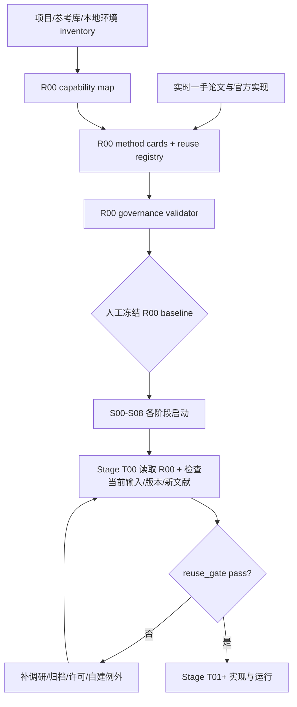

# R00 文献、已有研究与可复用实现基线设计

## 阶段定位

R00 在数据工程和模型工程之前执行，用于回答“项目已经拥有什么、领域中有哪些成熟方法、哪些官方实现可以复用、哪些能力仍有缺口”。它把零散的方法卡、论文、依赖和设计想法整理成一个可查询的复用基线，防止后续各阶段从空白开始重复造轮子。

R00 不是一次完成后永久有效的总调研。论文、软件版本、许可、项目输入和任务 interface 都会变化，因此 S00–S08 仍必须在实际开工时执行自己的 `T00`。R00 提供索引和候选起点；T00 对当前任务作现场复核与最终选择。

## 本阶段要回答的问题

1. 当前参考资料库已经覆盖哪些科学方法、模型、评测协议和软件实现？
2. 仓库及本地环境中已经有哪些可直接调用的代码、依赖和工具？
3. S00–S08 分别需要哪些 capabilities，当前成熟方案和资料缺口在哪里？
4. 每个候选的官方实现、当前版本、许可证、维护状态和 interface 是什么？
5. 哪些论文/方法卡需要新增或补全，才能支持后续阶段的真实选择？
6. 如何用统一 decision interface 和校验器阻止未调研、自建例外缺证据或嵌套 AGENTS 绕过根规范？
7. 因果证据链是否明确区分实验内分配效应、实际敲低剂量效应、跨背景运输效应和最终预测分布，并为每一层找到适配的成熟分析能力？

## 输入与输出

| 类型 | 内容 | 本阶段产物 |
| --- | --- | --- |
| 项目输入 | 根/阶段 design、plan、已有代码与配置 | Stage capability map 和 project asset inventory |
| 资料输入 | `参考资料库/idea库`、方法卡、论文、竞赛资料 | Reference coverage/gap report |
| 审计输入 | `document/项目审计/` 中尚未落实的审阅 | 审阅意见的采纳/拒绝、capability gap 与落实映射 |
| 环境输入 | 标准库、已安装 Python/R/CLI 依赖及版本 | Installed capability inventory |
| 实时输入 | 当前一手论文、官方仓库、release/changelog、license | 有日期的候选与许可快照 |
| 知识输出 | `参考资料库/reuse_registry.yaml` | capability → candidate/interface/license/stage 映射 |
| 治理输出 | 方法卡、索引、复用决策模板 | 后续 T00 的统一输入和产物格式 |
| 校验输出 | 复用 gate checker 与测试 | 检查 T00、归档、decision 和 AGENTS 作用域 |

## 核心实施方式

### 1. 先清点项目存量

搜索当前仓库的代码、脚本、配置、测试、历史报告和方法卡，区分“设计上提到”“本地已有实现”“已经验证可用”三种状态。方法卡链接到官方仓库不等于代码已经安装，已有包名也不等于版本和许可证已核实。

对于每个资产，记录提供的 module、调用 interface、输入输出、当前消费者、验证状态和适用限制。这样后续阶段能直接找到可复用 seam，而不是再次遍历整个项目。

### 2. 建立阶段 capability map

把 S00–S08 的需求拆成能力，而不是预先绑定某个产品名。例如：稀疏 AnnData 读取、guide QC、字段时间顺序/协变量角色登记、group-safe folds、biology-vs-protocol 拆分、NMF、condition-level uncertainty、hierarchical meta-regression、balance weighting、guide-IV 可行性审计、GRN candidate generation、跨环境异质性/等效性评估、matrix exponential、ODE solving、single-cell count generation、official submission validation。

每个 capability 映射到：现有项目实现、标准/native 能力、已安装依赖、参考库登记实现、需要实时补查的缺口。该映射决定后续阶段 T00 的最低搜索范围，但不替代最终选择。

### 3. 实时一手资料和官方实现调研

对高优先级缺口检索最新论文官方页面、官方代码仓库、release/changelog 和许可证。优先寻找可独立复用的深 module，例如 solver、fold builder、metric runner、GRN estimator 或数据 adapter，而不是为了复用整套框架而引入大量无关假设。

候选比较包括科学 estimand、识别假设、统计单位、interface、数据规模、稀疏性、fold/leakage、维护状态、许可和改造成本。对于因果能力，必须区分默认低假设路径与有条件分支；搜索摘要和二手综述只帮助发现来源，不能成为 registry 的最终证据。

### 4. 归档与 registry

进入 shortlist 的新方法先按 `参考资料库/rules.md` 建立方法卡并加入文献索引。`reuse_registry.yaml` 只保存稳定、机器可查询的信息和方法卡路径，不复制长篇论文摘要；实际调研证据保存在 R00 reports。

Registry 记录的是“当时可考虑复用”，而不是永久授权。版本、许可和 task fit 在每个 stage T00 中刷新。

### 5. 复用 gate 校验器

校验器使用小 interface 读取 stage plan/progress、reuse decision 和参考索引，检查：

- 每个直接 stage 的 AGENTS symlink 都解析到根 AGENTS，且没有 override、深层 AGENTS 或 symlink drift；
- 每阶段存在 T00，且 T01+ 不领先于 `reuse_gate: pass`；
- decision 中的方法卡、路径、版本、许可和自建例外字段完整；
- shortlist 新方法已进入参考资料库索引。

它只验证治理证据是否齐全，不判断方法在科学上正确。

## R00 与 Stage T00 的关系

## 人工需要决定什么

- capability map 是否遗漏关键方法能力；
- shortlist 和资料库缺口的优先级；
- license/维护状态不明确的资产是否保留候选；
- `minimal_new` 的人工批准范围；
- registry、方法卡和校验器是否足以冻结为项目复用基线。

任务分解和完成闸门见 [`AI_plan.md`](AI_plan.md)。统一规则见 [`../../../参考资料库/rules.md`](../../../参考资料库/rules.md)。

## 完成后实现了什么

R00 完成意味着项目拥有一份经过现场调研、版本化且可校验的复用基线，使后续 agent 能快速找到成熟 module 和明确缺口。它不选择所有未来实现，也不证明任何方法适用于真实数据；每个 stage T00 仍须重新调研并作出当前决策。
